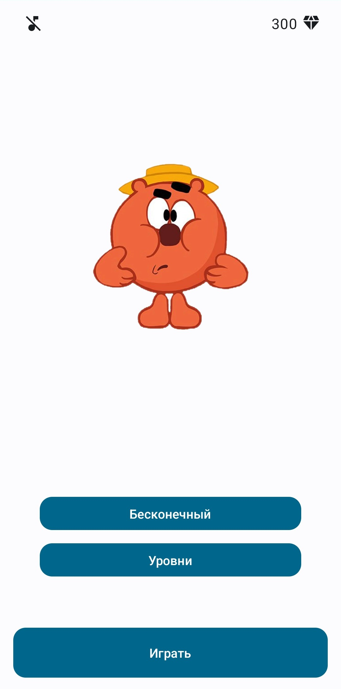
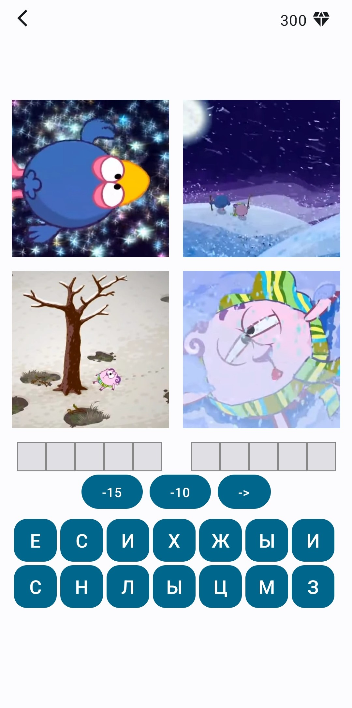
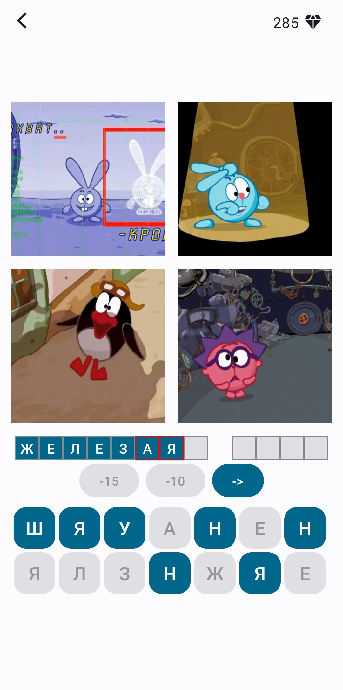
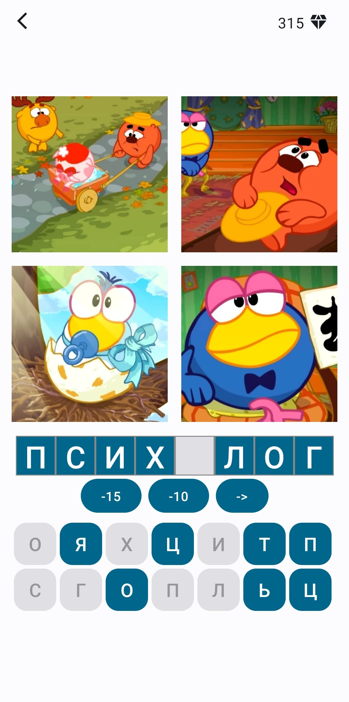

# Викторина от Копатыча

"Викторина от Копатыча" - мобильная игра-викторина, основанная на мультсериале Смешарики, где игрокам предстоит отгадывать название серии по 4 картинкам.

## Скриншоты

  
  
  
  

## Описание

 Приложение представляет собой веселую викторину, в которой игроки могут проверить свои знания о мультсериале "Смешарики". Игрокам предлагается угадывать названия серий по предоставленным картинкам. 
 
 Приложение имеет два режима игры:

- **Уровни  :** В этом режиме игроки могут пройти через заранее созданные уровни с вопросами, чтобы проверить свои знания.
- **Бесконечный режим:** В этом режиме приложение использует парсинг данных из интернета для загрузки новых вопросов и картинок, предоставляя бесконечное количество уровней для игры.

## Технологии

- 
- 
- 
- 
- Android Architecture Components:
  - 
  - 
  - 

## Установка

1. Клонируйте репозиторий: `git clone https://github.com/your/repository.git`
2. Откройте проект в Android Studio.
3. Соберите и запустите приложение.

## Использование

- Запустите приложение на устройстве или эмуляторе.
- Выберите режим игры: "Уровни" или "Бесконечный режим".
- Отгадывайте название серий, основываясь на предоставленных 4 изображениях.
